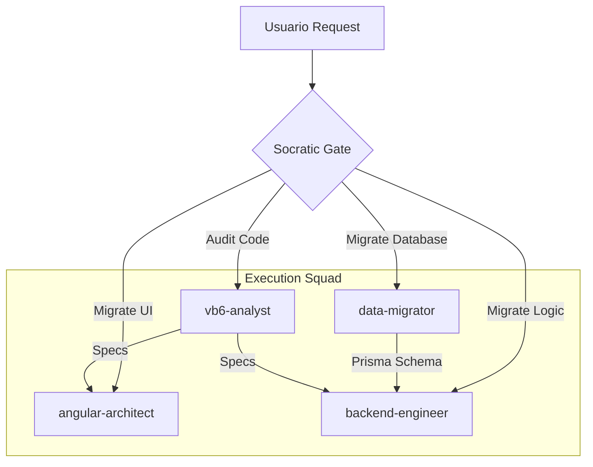

# Agent Routing Flow

> This document defines how `migration-orchestrator` routes requests.

## Flow Diagram

## Routing Logic

1.  **Keyword**: `database`, `access`, `tables`, `schema` -> **data-migrator**
2.  **Keyword**: `ui`, `form`, `screen`, `design`, `css` -> **angular-architect**
3.  **Keyword**: `logic`, `function`, `api`, `backend` -> **backend-engineer**
4.  **Keyword**: `analyze`, `audit`, `report`, `understand` -> **vb6-analyst**

## Fallback
If the request is complex or involves multiple domains (e.g. "Migrate the Login feature"), route to **migration-orchestrator**.
